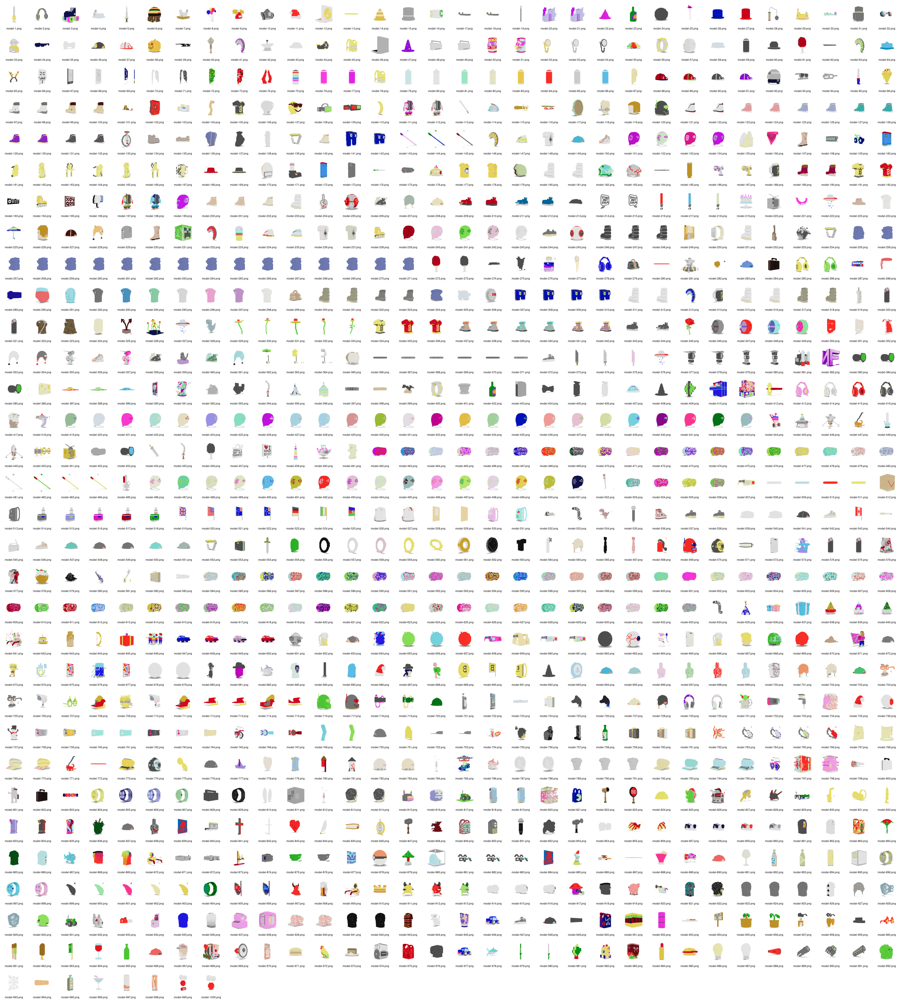
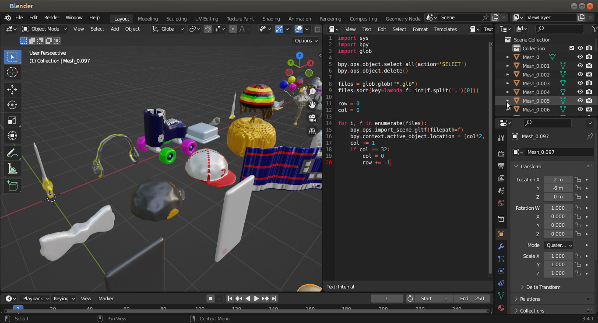

# Scripts

- Download [svox-tools](https://github.com/webspace-sdk/svox-tools)
  - https://github.com/webspace-sdk/svox-tools/releases
- Additional docs: https://svox.glitch.me/

## vox2svox

Convert all `.vox` files in current directory to `.svox` with compression

`for i in *.vox; do vox2svox -c on "$i" "${i%.vox}.svox";done`

Deform all `.vox` to smoothened `.svox` files and make shiny

`for i in *.vox; do vox2svox -c on -k "deform = 1 1, lighting = smooth, roughness = 0.3, metalness = 0.6" "$i" "${i%.vox}.svox";done`

## svox2gltf

Convert all svox in current directory to glTF binary (`.glb`) files

`for i in *.svox; do svox2gltf -b "$i" "${i%.svox}.glb";done`

## glTF Transform

- Download: https://gltf-transform.donmccurdy.com/cli.html

Use draco compression method to optimize all the glbs in current directory

`for i in *.glb; do gltf-transform draco "$i" out_"$i".glb; done`

---

# Vizualize

## 1. Model Viewer renders

`render.html`

Recommended to use Chromium for the render.html screenshotter so thumbnails automatically download. This script will take a picture of every glb in current directory at a certain angle. Start a web server to use it.

> Special thanks to pigloo for the model-viewer thumbnail generator. 

## 2. Montage tiles

`montage.sh`

This will create a big picture atlas of all the thumbnail previews with the
filename as labels. Recommended to resize all images to power of 2 and to be
small enough resolution to run without crashing. For this example I resized all
the images to be 192x128 resolution before montage.

## 3. Loading bar

`horizontal_scroll.sh`

Will create an mp4 scrolling animation from all the thumbnail pics:

https://user-images.githubusercontent.com/32600939/209912120-d9be878f-1d11-4250-a8de-f363d44862ef.mp4

## 4. Blender Array

`arrange.py`

Imports objects in current directory into blender as an array of objects,
sorted by name. To use, have blender installed and run this in a terminal:

`blender --python arrange.py`

> Note: you must be in a folder where the glbs are located
